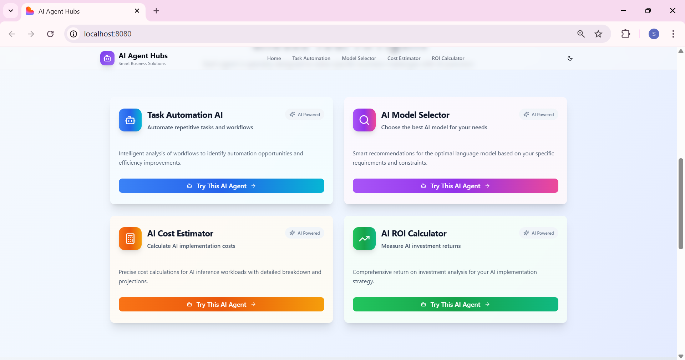
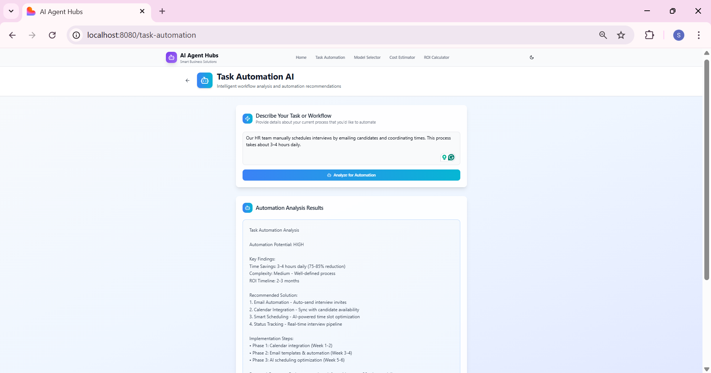
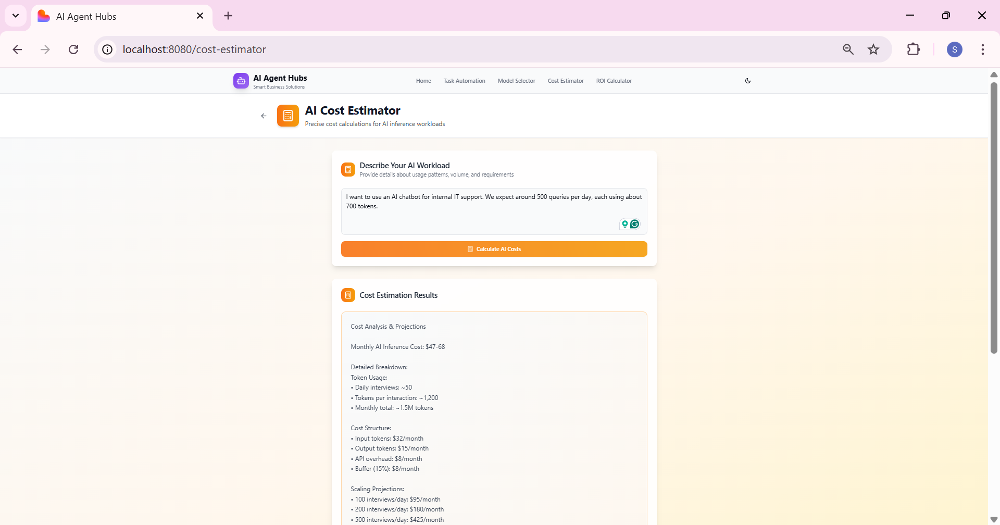
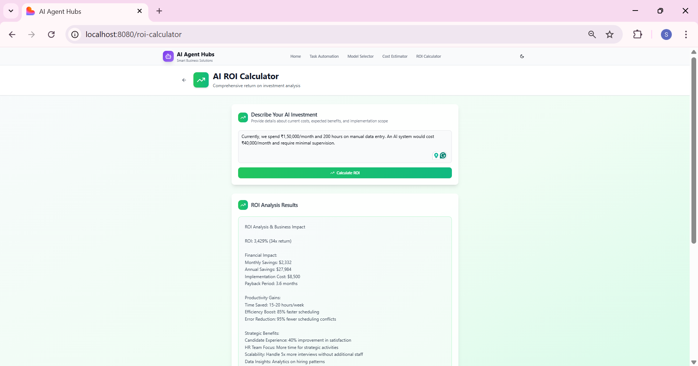

# 🤖 AI Agent Hub

<div align="center">

[](https://choosealicense.com/licenses/mit/)
[](https://reactjs.org/)
[](https://www.typescriptlang.org/)
[](https://tailwindcss.com/)
[](https://vitejs.dev/)
[](https://nodejs.org/)

**🚀 A comprehensive web application featuring intelligent AI agents designed to help businesses automate tasks, select optimal AI models, estimate costs, and calculate ROI for AI implementations.**

[🌐 Live Demo](https://your-demo-url.com)



</div>

---


## 🚀 Overview

AI Agent Hub is a cutting-edge React-based web application that empowers businesses with four specialized AI agents to solve complex automation and decision-making challenges. Built with modern technologies and a focus on user experience, it provides intelligent insights for:

<div align="center">

| 🔄 **Task Automation** | 🎯 **Model Selection** | 💰 **Cost Estimation** | 📊 **ROI Analysis** |
|:---:|:---:|:---:|:---:|
| Workflow Analysis | Smart Recommendations | Precise Calculations | Investment Planning |
| Automation Opportunities | Performance Comparison | Budget Planning | Time-to-Value |
| Implementation Strategy | Technical Requirements | Scaling Projections | Cost-Benefit Analysis |

</div>

---

## ✨ Features

### 🎨 **Modern UI/UX Design**
- 📱 **Responsive Design** - Works flawlessly on all devices
- 🌙 **Dark/Light Theme** - Seamless theme switching
- ⚡ **Smooth Animations** - Buttery smooth transitions
- 🎭 **Glass-morphism Effects** - Modern visual aesthetics
- 🎨 **Gradient Designs** - Professional color schemes
- 🔄 **Loading States** - Engaging user feedback

### 🛠️ **Technical Excellence**
- ⚛️ **React 18** - Latest React features with concurrent rendering
- 📘 **TypeScript** - Type-safe development
- 🎨 **Tailwind CSS** - Utility-first CSS framework
- 🧩 **shadcn/ui** - Beautiful, accessible components
- 🔄 **React Query** - Powerful data fetching and caching
- 🛣️ **React Router** - Client-side routing
- ⚡ **Vite** - Lightning-fast build tool

### 🔐 **Security & Performance**
- 🔒 **Type Safety** - Comprehensive TypeScript coverage
- 🚀 **Code Splitting** - Optimized bundle sizes
- 🌳 **Tree Shaking** - Remove unused code
- 💾 **Efficient Caching** - Smart data management
- 📊 **Performance Monitoring** - Real-time metrics

---

## 🤖 AI Agents

### 1. 🔄 **Task Automation AI**
<div align="center">



</div>

**🎯 Purpose**: Analyzes business workflows and identifies automation opportunities

**🔧 Capabilities**:
- 📋 **Workflow Analysis** - Deep dive into current processes
- 🔍 **Automation Detection** - Identifies repetitive tasks
- 💡 **Implementation Roadmap** - Step-by-step automation strategy
- 💸 **ROI Calculation** - Time and cost savings estimation
- 🛠️ **Tool Recommendations** - Best automation tools for your needs

**📊 Use Cases**:
- HR processes automation
- Customer service workflows
- Data entry optimization
- Report generation
- Email marketing automation

---

### 2. 🎯 **AI Model Selector**
<div align="center">


</div>

**🎯 Purpose**: Recommends optimal AI models based on specific requirements

**🔧 Capabilities**:
- 🧠 **Smart Recommendations** - AI-powered model selection
- ⚖️ **Multi-factor Analysis** - Performance, cost, and technical requirements
- 📊 **Model Comparison** - Side-by-side feature analysis
- 📝 **Detailed Reports** - Comprehensive reasoning and analysis
- 🎛️ **Custom Filtering** - Filter by budget, performance, and use case

**📊 Supported Models**:
- OpenAI GPT series
- Anthropic Claude
- Google Gemini
- Meta Llama
- Cohere Command
- And many more...

---

### 3. 💰 **AI Cost Estimator**
<div align="center">



</div>

**🎯 Purpose**: Provides precise cost calculations for AI workloads

**🔧 Capabilities**:
- 🧮 **Precise Calculations** - Accurate cost estimation
- 📈 **Usage Patterns** - Detailed breakdown by usage
- 📊 **Scaling Projections** - Future cost predictions
- 💼 **Budget Planning** - Financial planning assistance
- 📋 **Cost Optimization** - Recommendations to reduce expenses

**📊 Cost Factors**:
- API calls and tokens
- Model complexity
- Usage volume
- Peak traffic handling
- Storage requirements

---

### 4. 📊 **AI ROI Calculator**
<div align="center">



</div>

**🎯 Purpose**: Comprehensive return on investment analysis for AI implementations

**🔧 Capabilities**:
- 📈 **ROI Analysis** - Complete financial impact assessment
- ⏱️ **Time-to-Value** - Payback period calculations
- 💼 **Cost-Benefit Analysis** - Detailed financial comparison
- 📋 **Investment Planning** - Strategic implementation insights
- 📊 **Risk Assessment** - Potential challenges and mitigation

**📊 ROI Metrics**:
- Initial investment costs
- Operational savings
- Productivity gains
- Revenue enhancement
- Risk mitigation value

---

## 🔗 Lyzr AI Studio Integration

### 🏗️ **Backend AI Agent Architecture**

This frontend application is powered by **Lyzr AI Studio** agents that handle all the intelligent processing and analysis. The connection architecture works as follows:

#### 🤖 **AI Agent Backend**
- **🏭 Lyzr AI Studio Agents** - Four specialized agents built using Lyzr's enterprise AI platform
- **🔌 RESTful API Integration** - Seamless communication between Lovable frontend and Lyzr agents
- **⚡ Real-time Processing** - Instant AI-powered analysis and recommendations
- **🧠 Advanced LLM Models** - Leveraging state-of-the-art language models through Lyzr's infrastructure

#### 🔄 **Connection Flow**
```
📱 Lovable Frontend → 🌐 API Gateway → 🤖 Lyzr AI Studio Agents → 📊 Analysis Results → 📱 Frontend Display
```

#### 🛠️ **Technical Integration**
- **📡 API Endpoints** - Each AI agent exposes specific endpoints for different analysis types
- **🔐 Authentication** - Secure API key-based authentication with Lyzr AI Studio
- **📊 Data Processing** - Lyzr agents process user input and return structured analysis
- **⚡ Response Handling** - Frontend efficiently handles and displays AI-generated insights

#### 🎯 **Agent-Specific Connections**
1. **🔄 Task Automation Agent** - Connected to Lyzr's workflow analysis AI
2. **🎯 Model Selector Agent** - Integrated with Lyzr's recommendation engine
3. **💰 Cost Estimator Agent** - Powered by Lyzr's financial calculation AI
4. **📊 ROI Calculator Agent** - Connected to Lyzr's investment analysis AI

This architecture ensures that the beautiful Lovable-built frontend seamlessly communicates with powerful Lyzr AI Studio agents to deliver intelligent, accurate, and actionable business insights.

---

## 🛠️ Tech Stack

<div align="center">

### **Frontend Technologies**
| Technology | Purpose | Version | Status |
|:---:|:---:|:---:|:---:|
| ⚛️ **React** | Frontend Framework | 18.x | ✅ Active |
| 📘 **TypeScript** | Type Safety | 5.x | ✅ Active |
| 🎨 **Tailwind CSS** | Styling | 3.x | ✅ Active |
| 🧩 **shadcn/ui** | UI Components | Latest | ✅ Active |
| 🛣️ **React Router** | Routing | 6.x | ✅ Active |
| 🔄 **React Query** | State Management | Latest | ✅ Active |
| ⚡ **Vite** | Build Tool | 4.x | ✅ Active |
| 🎭 **Lucide React** | Icons | Latest | ✅ Active |
| 📊 **Recharts** | Charts | Latest | ✅ Active |


</div>

---

## 🏗️ Architecture

<div align="center">

### **Project Structure**
```
📁 ai-agent-hub/

> Documentation
> Images
> jvz-Agents
> public
> src
 .gitignore
 bun.lockb
 components.json
 eslint.config.js
 index.html
 package-lock.json
 package.json
 postcss.config.js
 README.md
 tailwind.config.ts
 tsconfig.app.json
 tsconfig.json
 tsconfig.node.json
 vite.config.ts
```
</div>

---

## 🚀 Getting Started

### 📋 Prerequisites

Before you begin, ensure you have the following installed:

- 📦 **Node.js** (v16.0 or higher)
- 📦 **npm** or **yarn** package manager
- 🔧 **Git** for version control

### 🛠️ Installation

Follow these steps to set up the project locally:

#### 1. 📥 **Clone the Repository**
```bash
git clone https://github.com/SimranShaikh20/ai-agent-hub.git
cd ai-agent-hub
```

#### 2. 📦 **Install Dependencies**
```bash
# Using npm
npm install

# Using yarn
yarn install
```

#### 3. 🔧 **Environment Setup**
```bash
# Copy environment file
cp .env.example .env.local

# Edit your environment variables
nano .env.local
```

#### 4. 🚀 **Start Development Server**
```bash
# Using npm
npm run dev

# Using yarn
yarn dev
```

#### 5. 🌐 **Open in Browser**
Navigate to `http://localhost:5173` to see the application running.

### 🏗️ Build for Production

```bash
# Build the application
npm run build

# Preview the build
npm run preview
```

The built files will be available in the `dist` directory.


---

## 🎯 Usage Guide

### 🚀 **Quick Start**

1. **🏠 Navigate to Home**: Visit the main page to see all available AI agents
2. **🎯 Select Agent**: Choose the AI agent that matches your specific needs
3. **📝 Input Requirements**: Provide detailed information about your use case
4. **🔍 Get Analysis**: Click analyze to receive intelligent recommendations
5. **📊 Review Results**: Examine the AI-generated insights and next steps

### 💡 **Example Use Cases**

#### 🔄 **Task Automation Example**
```
📝 Input: 
"Our customer service team manually responds to 200+ support tickets daily. 
Common queries include password resets, billing questions, and product information. 
This process takes 6 hours daily and costs $50/hour."

📊 Output:
✅ Automation potential: 70% of tickets
💰 Cost savings: $2,100/month
⏱️ Time savings: 25 hours/week
🛠️ Recommended tools: Zendesk AI, Intercom Resolution Bot
📋 Implementation timeline: 2-3 weeks
```

#### 🎯 **Model Selection Example**
```
📝 Input:
"Need an AI model for real-time customer chat with 1000+ daily conversations.
Requirements: Fast response (<2s), cost-effective, handles multiple languages,
integrates with existing CRM system."

📊 Output:
🥇 Top Recommendation: GPT-3.5 Turbo
💰 Estimated cost: $150/month
⚡ Response time: <1s
🌍 Languages: 50+ supported
🔗 CRM Integration: Available via API
📈 Scalability: Up to 10,000 conversations/day
```

### 🔧 **Advanced Features**

#### 📊 **Custom Analysis**
- Upload your own data files (CSV, JSON)
- Set specific parameters and constraints
- Compare multiple scenarios side-by-side
- Export results in various formats

#### 🎛️ **Filtering Options**
- Budget constraints
- Performance requirements
- Industry-specific needs
- Technical specifications

---


### 🛠️ **Manual Deployment Options**

#### ▲ **Vercel**
```bash
npm i -g vercel
vercel --prod
```

#### 🌐 **Netlify**
```bash
npm run build
# Drag & drop 'dist' folder to Netlify
```

#### 📄 **GitHub Pages**
```bash
npm run build
npm run deploy
```

#### ☁️ **AWS S3 + CloudFront**
```bash
aws s3 sync dist/ s3://your-bucket-name
aws cloudfront create-invalidation --distribution-id YOUR_ID --paths "/*"
```

## 🤝 Contributing

We welcome contributions from the community! Here's how to get started:

### 🔧 **Development Setup**

1. **🍴 Fork the repository**
2. **🌿 Create a feature branch**
   ```bash
   git checkout -b feature/amazing-feature
   ```
3. **💾 Make your changes**
4. **✅ Run tests**
   ```bash
   npm run test
   npm run type-check
   npm run lint
   ```
5. **📤 Push to branch**
   ```bash
   git push origin feature/amazing-feature
   ```
---

## 📊 Performance

### ⚡ **Optimization Features**

- 🔄 **Code Splitting**: Dynamic imports for optimal loading
- 🌳 **Tree Shaking**: Remove unused code automatically
- 🖼️ **Image Optimization**: Compressed and responsive images
- 💾 **Caching Strategy**: Smart caching for better performance
- 📱 **Mobile Optimization**: Optimized for mobile devices


### 🔍 **Bundle Analysis**

```bash
# Analyze bundle size
npm run analyze

# Performance audit
npm run audit
```

---

## 🔮 Roadmap

### 🎯 **Phase 1: Foundation** _(Completed)_
- [x] 🏗️ Core architecture setup
- [x] 🤖 Four AI agents implementation
- [x] 🎨 Modern UI/UX design
- [x] 📱 Mobile responsiveness
- [x] 🌙 Dark/Light theme

### 🚀 **Phase 2: Enhancement** _(In Progress)_
- [x] 🔐 User authentication system
- [ ] 💾 Save and export analysis results
- [ ] 📊 Advanced analytics dashboard
- [ ] 🔗 Third-party integrations
- [ ] 🌍 Multi-language support

### 🌟 **Phase 3: Advanced Features** _(Planned)_
- [ ] 🤖 Custom AI agent creation
- [ ] 📱 Mobile app (React Native)
- [ ] 🔌 REST API for developers
- [ ] 🏢 Enterprise features
- [ ] 🤝 Team collaboration tools

### 🔮 **Phase 4: AI Evolution** _(Future)_
- [ ] 🧠 Advanced machine learning models
- [ ] 🔮 Predictive analytics
- [ ] 🎯 Personalized recommendations
- [ ] 🔄 Continuous learning system
- [ ] 🌐 Multi-modal AI support

---

## 📄 License

This project is licensed under the **MIT License** - see the [LICENSE](LICENSE) file for details.

```
MIT License

Copyright (c) 2024 AI Agent Hub

Permission is hereby granted, free of charge, to any person obtaining a copy
of this software and associated documentation files (the "Software"), to deal
in the Software without restriction, including without limitation the rights
to use, copy, modify, merge, publish, distribute, sublicense, and/or sell
copies of the Software, and to permit persons to whom the Software is
furnished to do so, subject to the following conditions:

The above copyright notice and this permission notice shall be included in all
copies or substantial portions of the Software.
```


</div>

### 🔧 **Self-Help Resources**

- 📖 **[Documentation](./docs/)** - Comprehensive guides
- 🎥 **[Video Tutorials](https://youtube.com/aiagentshub)** - Step-by-step walkthroughs
- 💡 **[FAQ](./docs/FAQ.md)** - Common questions answered
- 🛠️ **[Troubleshooting](./docs/TROUBLESHOOTING.md)** - Problem-solving guide

### 🤝 **Community**

Join our growing community of developers and AI enthusiasts:

- 💬 **Discord Server**: Real-time chat and support
- 📱 **Telegram Group**: Quick updates and discussions
- 🐦 **Twitter**: Latest news and announcements
- 📧 **Newsletter**: Monthly updates and tips

---

## 🌟 Acknowledgments

We're grateful to the amazing open-source community and these fantastic projects:

### 🛠️ **Core Technologies**
- 🔥 **[React](https://reactjs.org/)** - The library for web and native user interfaces
- 📘 **[TypeScript](https://www.typescriptlang.org/)** - Typed JavaScript at Any Scale
- 🎨 **[Tailwind CSS](https://tailwindcss.com/)** - Utility-first CSS framework
- ⚡ **[Vite](https://vitejs.dev/)** - Next generation frontend tooling

### 🎨 **Design & UI**
- 🧩 **[shadcn/ui](https://ui.shadcn.com/)** - Beautifully designed components
- 🎭 **[Lucide](https://lucide.dev/)** - Beautiful & consistent icons
- 🌈 **[Radix UI](https://www.radix-ui.com/)** - Low-level UI primitives

### 🔧 **Development Tools**
- 🛠️ **[Lovable](https://lovable.dev/)** - The fastest way to build web apps
- 🔄 **[TanStack Query](https://tanstack.com/query)** - Powerful data synchronization
- 📊 **[Recharts](https://recharts.org/)** - Composable charting library

### 🙏 **Special Thanks**
- 💡 **Our Contributors** - Amazing people who make this project better
- 🌍 **The Community** - Feedback, bug reports, and feature requests
- 🎓 **Beta Testers** - Early adopters who helped shape the product


---

⭐ **If you found this project helpful, please consider giving it a star!** ⭐

</div>